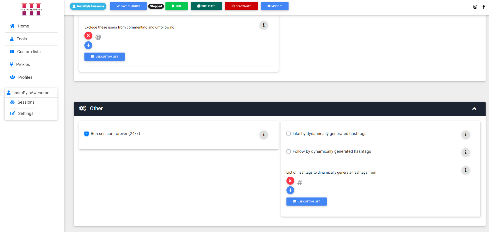

# InstaHappily

The project is called InstaHappily and it is the combination of GUI, installer for windows and a windows service for a popular Instagram automation bot InstaPy: https://github.com/timgrossmann/InstaPy (which is not mine, but open sourced).

Since InstaPy is a bot written in python it was hard for end users (general public) to set it up, install, modify, etc. So InstaHappily was born to overcome those obstacles.

InstaPy is written in Python, so my decision was ofcourse Python, also utilising Chrome + Selenium for bot actions. 

This project (InstaHappily) is written by using Flask, which is micro web framework in Python, and all good that comes with it like Jinja2 for templating and SQLAlchemy for managing SQLite DB where all the data is stored. To be able to run the bot I had to implement couple levels of multi-processing in Python with a combination of creating a Windows service to handle the app itself. 

All of that is running on Flask dev http web server and the idea was to run it on clients machines so everything is shipped in an installer which I wrote using InnoSetup. InnoSetup is one of the installer tools that enables you to write installers for Windows in their specific language (or expressions) with a posibility of using Pascal as a language to add additional features to the installer. I'm using Pascal to add some extras. 

Since having Chrome was must have on a client machine, Chrome installer was part of this project installer as well. Also the installer will install Python on a client machine. Idea is to switch to a frozen app later in development meaning Python wouldn't be necessary to install on clients. 

The GUI, which is actually a web interface running in Chrome and technically a web app, is using some of the popular front-end frameworks and tools like Bootstrap (MD Bootstrap as a framework, JQuery), FontAwesome, SCSS, Gulp (to build and automate) so in general Javascript, HTML and CSS (SCSS). I used Chart.js to add some nice graphs to the interface.

Techstack: Python 3.6, Flask, Jinja2, SQLiteDB, SQLAlchemy, Flask-migrate (Alembic SQlite), Bootstrap (MDBootstrap), SCSS, Javascript, jQuery, Gulp, Chart.js, InnoSetup

Home:


Adding profile:


Creating session:


Full examples for each setting:


Ability to run session forever:


Checkout more images in "gui-images" folder: https://github.com/antonio-piha/instahappily/tree/master/gui-images

# Dev
mklink /D "node_modules" "D:\PROJEKTI\COMMON\npm\node_modules"

InstaPy is not included in the repository and before dev it should be added to the repo to the folder InstaPy (create new folder with that name and put the bot code inside)

# App
py -3.6 -m pip install -U pip
py -3.6 -m venv env
python -m pip install -U pip

pip install -r requirements.txt
pip install -U -r requirements.txt

# Database


## Schema migration
Only "upgrade" command should be used in production

This is how to initiate with multidb set-up:
Run/db_migrate.bat

```flask db init --multidb```

Then:

```flask db migrate```

## Data migration

Modify the generated migration script with: op.execute()
https://alembic.sqlalchemy.org/en/latest/ops.html#alembic.operations.Operations.execute
